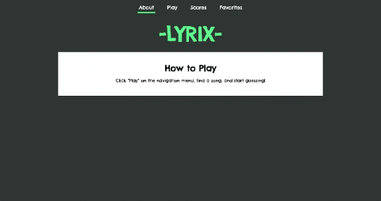

# Lyrix

## Abstract

Lyrix is an application that allows users to test their knowledge of top-charting song lyrics. The user can select a song and try to guess a missing word from a line of lyrics. This application exclusively uses functional React components through the use of hooks. 

## Installation Instructions 

1. Clone down the repo into your desired folder.
2. Run: `npm install`
3. Run: `npm start`
4. Navigate to [http://localhost:3000](http://localhost:3000) in your browser.

## Contributors
* [Elliot Mackinnon](https://github.com/emackinnon1)
* [Brian Roxbury](https://github.com/broxbury)
* [Kyle Williams](https://github.com/KCWill)

## Technologies Used

1. React
2. Functional components with hooks
3. React Hook Form Package

## Composition

